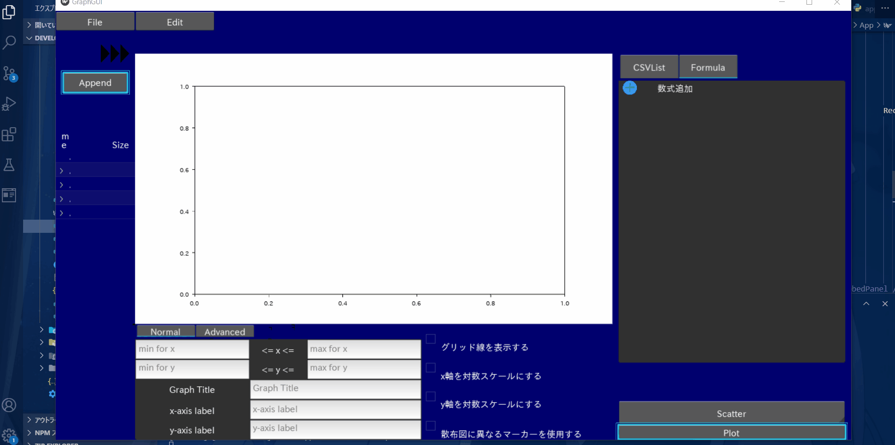

# Graph Writer by Kivy

いろんな機能詰め込んだKivyによるグラフ描画GUIです。
python3系を想定。3.7, 3.8系は恐らく動作します。


これは開発中に撮影したデモです。一部のデザインが変化しています。

## requirements

必要なモジュールをインストールしてください。仮想環境等をお勧めします。

```
    pip install -r requirements.txt
```

[ply_tex2sym](https://github.com/AkiraHakuta/ply_tex2sym)を利用していますが、こちらにはライセンスがなく、自分のリポジトリに含めると無断使用にあたる恐れがあるので、含めていません。
[ply_tex2sym](https://github.com/AkiraHakuta/ply_tex2sym)からtex2sym_lexer.py, tex2sym_parser.pyをダウンロードして、
libs/ply_tex2symにおいてください。その後それぞれのimport文を一部変更します。

```
from tex2sym_lexer import tokens, lexer
```

を

```
from libs.ply_tex2sym.tex2sym_lexer import tokens, lexer
```

に変更します。なおこのply_tex2symの動作に必要なライブラリはrequirements.txtに含めています。

## execute

python3.7, 3.8での動作は確認しました。
検証していませんが2.x系は多分動きません。

基本的にmain.pyと同階層での実行を想定しています。
もし C:\hogehoge にmain.pyを含めて置いた場合は

```
C:\user\hoge> cd C:\hogehoge
C:\hogehoge> python main.py
```

のように、カレントディレクトリを同階層にしてからmain.pyを実行してください。

## save state / load state

右上のボタンから終了をすると、その状態が保存されます。
つまり次回起動時に全く同じ状態から起動します。

また現在の状態を保存・あるいは異なる状態を読み込みしたい場合、左上のFileボタンを押すことで選択肢がでてきます。
Save stateで状態を保存します。またLoad stateで状態ファイル(*.json)を新たに保存します。
Load stateすると、現在の状態は破棄されるので注意してください。

また、Load Stateに失敗した場合(ファイルで指定されているパスが存在しないなど)、特にGUI上では変化しなかったりします。
その場合はコマンドプロンプト(シェル等)で原因のメッセージを確認してください。

